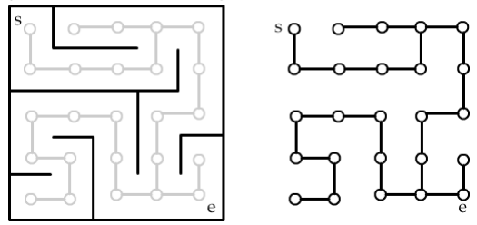

# PI - Grafos

[English](#english)
|
[Português](#português)

## English

## 🗎 Article

 - [Overleaf Article](https://www.overleaf.com/read/zndcmyykfttq#d9dfd0)

## Project Status

## Project Description

 
    PI Grafos is a Java project developed as part of a college assignment. The project involves maze navigation using a provided API. The API, hosted at https://gtm.delary.dev, allows users to interact with and navigate through generated mazes. The navigation involves a user being monitored within a labyrinth, starting from a specified initial position, and making decisions on possible movements.

## 📁 Access the Project

- The project is hosted on GitHub: [PI Grafos GitHub Repository](https://github/iLuiszin/projeto-pigrafos)
- You can also access the API used: [PI Grafos API](https://github.com/rambim/graph_theory_maze)

## 📝 Requirements

- Java SDK (version 17)
- Apache Maven (version 3)

## 🔨 Project Features

- **Automatic Labyrinth Selection**: The project automatically selects a labyrinth from the available options provided by the API.

- **Real-time Navigation Monitoring**: The navigation is conducted in real-time, with the user making decisions on movements. The API validates each movement, and in some cases, the user might need to backtrack to ensure the validity of the chosen path.

- **Graph Representation and Shortest Path Finding**: The project creates a graph representation of the maze after mapping the navigation. It then employs a Depth-First Search (DFS) algorithm for navigation and subsequently uses a Breadth-First Search (BFS) algorithm to find the shortest path within the maze.

- **Backtracking for Valid Movements**: To ensure the validity of the chosen path, the project incorporates backtracking in navigation, allowing the user to revisit previous positions if needed.

## ▶ Run  the Project

To run the project locally, follow these steps:

1. Clone the repository: `git clone https://github.com/iLuiszin/projeto-pigrafos.git`
2. Navigate to the project directory: `cd projeto-pigrafos`
3. Build the project using Maven: `mvn clean install`
4. Run the project: `java -jar target/projeto-pigrafos.jar`

## 👨‍💻 Authors

[ Luís Felipe](https://github.com/iLuiszin) | [ Guilherme Queiroz](https://github.com/GuiQueirozRibeiro) | [ Arthur Rocha](https://github.com/ArthurRoch)
| :---: | :---: | :---: |

## Learning Resources

For more information on Java or on the API used, you can refer to the documentation:

- [Java documentation](https://docs.oracle.com/en/java/)
- [API documentation](https://github.com/rambim/graph_theory_maze)

Feel free to reach out if you have any questions or suggestions!

## Português

## 🗎 Artigo

 - [Artigo Overleaf](https://www.overleaf.com/read/zndcmyykfttq#d9dfd0)

## Status do Projeto

## Descrição do Projeto

 
    O PI Grafos é um projeto em Java desenvolvido como parte de um trabalho acadêmico. O projeto envolve a navegação por labirintos usando uma API fornecida. A API, hospedada em https://gtm.delary.dev, permite que os usuários interajam e naveguem por labirintos gerados. A navegação envolve um usuário sendo monitorado dentro de um labirinto, começando de uma posição inicial especificada e tomando decisões sobre movimentos possíveis.

## 📁 Acesso ao Projeto

- O projeto está hospedado no GitHub: [Repositório PI Grafos no GitHub](https://github/iLuiszin/projeto-pigrafos)
- Você também pode acessar a API utilizada: [API do PI Grafos](https://github.com/rambim/graph_theory_maze)

## 📝 Requisitos

- Java SDK (versão 17)
- Apache Maven (versão 3)

## 🔨 Funcionalidades do Projeto

- **Seleção Automática de Labirinto**: O projeto seleciona automaticamente um labirinto entre as opções disponíveis fornecidas pela API.

- **Monitoramento de Navegação em Tempo Real**: A navegação é conduzida em tempo real, com o usuário tomando decisões sobre os movimentos. A API valida cada movimento e, em alguns casos, o usuário pode precisar retroceder para garantir a validade do caminho escolhido.

- **Representação de Grafo e Encontrar o Caminho Mais Curto**: O projeto cria uma representação de grafo do labirinto após mapear a navegação. Ele utiliza um algoritmo de Busca em Profundidade (DFS) para navegação e, posteriormente, usa um algoritmo de Busca em Largura (BFS) para encontrar o caminho mais curto dentro do labirinto.

- **Retrocesso para Movimentos Válidos**: Para garantir a validade do caminho escolhido, o projeto incorpora retrocesso na navegação, permitindo que o usuário volte a posições anteriores, se necessário.

## ▶ Executando o Projeto

Para executar o projeto localmente, siga estas etapas:

1. Clone o repositório: `git clone https://github.com/iLuiszin/projeto-pigrafos.git`
2. Navegue até o diretório do projeto: `cd projeto-pigrafos`
3. Compile o projeto usando o Maven: `mvn clean install`
4. Execute o projeto: `java -jar target/projeto-pigrafos.jar`

## 👨‍💻 Autores

[ Luís Felipe](https://github.com/iLuiszin) | [ Guilherme Queiroz](https://github.com/GuiQueirozRibeiro) | [ Arthur Rocha](https://github.com/ArthurRoch)
| :---: | :---: | :---: |

## Recursos de Aprendizado

Para mais informações sobre Java ou sobre a API utilizada, você pode consultar a documentação:

- [Documentação do Java](https://docs.oracle.com/en/java/)
- [Documentação API](https://github.com/rambim/graph_theory_maze)

Sinta-se à vontade para entrar em contato se tiver alguma dúvida ou sugestão!
